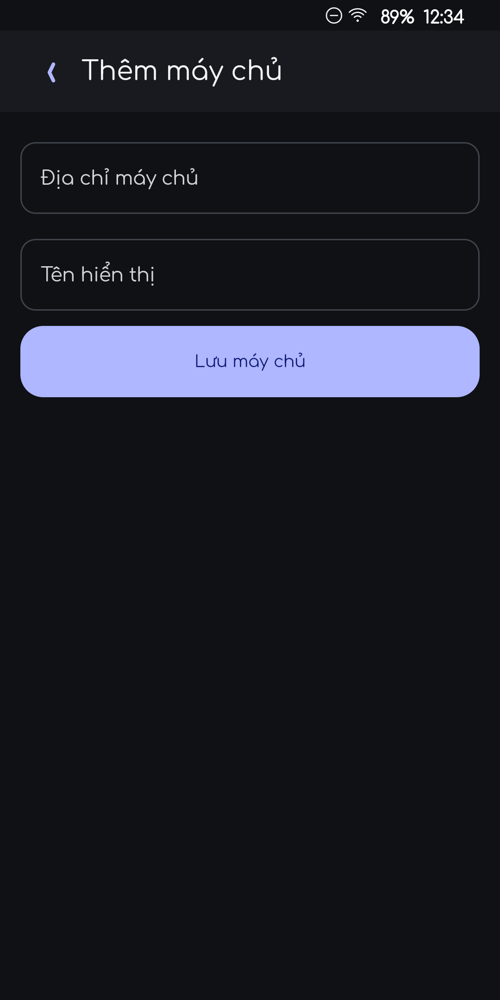
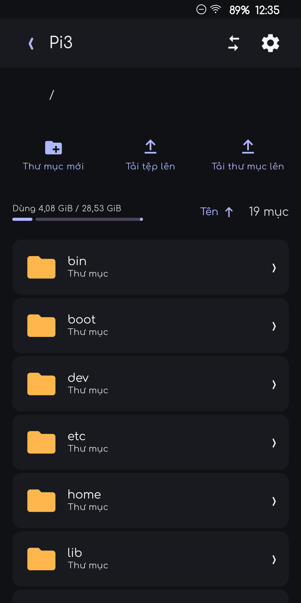
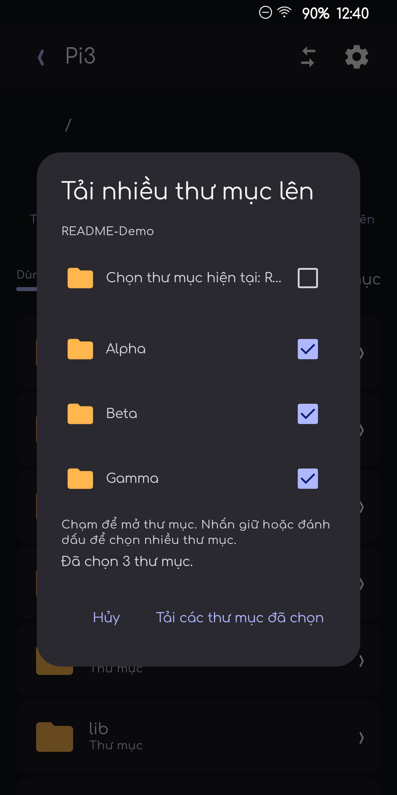

# File Server for Android

File Server is a native Android client for private File Browser deployments. It turns a Raspberry Pi, NAS, or small Linux host running File Browser into a full mobile file workspace: browse, preview, stream, upload, download, copy, move, share, synchronize, and administer files from one app.

The app is designed for Android 8.0+ and works with LAN, Tailscale, HTTPS domain, or any other reachable File Browser endpoint. It does not require a special cloud provider.

Current release: **v1.8.1** (`versionCode 13`)

## Screenshots

The screenshots below were captured from the Android client using a clean server form, the server root, and a safe demo folder tree. No personal media or private folder contents are included.

| Server setup | File browser | Multi-folder upload |
| --- | --- | --- |
|  |  |  |

## What the app does

### Server connections and accounts

- Save multiple File Browser servers with a display name and endpoint URL.
- Use different endpoints for the same deployment, such as LAN, Tailscale, and HTTPS domain.
- Test reachability before opening a server and keep the last working endpoint available.
- Log in with normal File Browser accounts and automatically renew expired session tokens.
- Keep server/account identity separate so sync folders do not accidentally cross between users or different File Browser installations.
- Support HTTP for a trusted LAN and HTTPS for remote access.

### File browsing

- Browse directories in list or grid layout.
- Navigate through breadcrumbs or an editable, horizontally scrollable path.
- Sort by name in ascending or descending order.
- Pull down to refresh and preserve the current path while opening settings or transfers.
- Show folder icons selected in app settings and sync status badges on synchronized folders.
- Show disk usage for the active server path.
- Respect permissions returned by File Browser for every operation.

### File operations

- Create folders.
- Upload one or many files.
- Upload one or many folders in one batch.
- Upload complete nested directory trees, including empty directories.
- Select folders with a long press or checkboxes inside the app's multi-folder picker.
- Download files and folders, including archive formats for multi-item downloads.
- Rename, delete, copy, move, share, and open files according to server permissions.
- Keep copy and move destination pickers inside the current server context.
- Warn about quota limits before uploads when the server reports file sizes.

### Reliable transfers

Transfers are stored in a durable local queue instead of being tied to a single screen.

- Uploads use resumable TUS requests when supported by the server.
- Downloads resume with HTTP Range requests after a network interruption.
- Pause and continue transfers from the app.
- Retry failed jobs without recreating the original selection.
- Keep progress across app restarts and recover interrupted jobs as queued work.
- Serialize uploads for small Raspberry Pi hosts while allowing downloads to use their own bounded lane.
- Throttle progress persistence so large transfers do not constantly write the Android preferences store.

### Preview and playback

- Preview images with neighboring-image navigation.
- Read text, Markdown, JSON, source code, logs, and other text-based files.
- Preview PDFs and supported documents.
- Stream authenticated audio and video with Android Media3.
- Play, pause, seek, jump backward/forward, and enter landscape fullscreen.
- Recognize common containers such as MP4, MOV, MKV, WebM, AVI, M2TS, and TS.
- Request server-generated video thumbnails through the shared thumbnail endpoint.
- Cache thumbnails with an automatic bounded cleanup policy.

### Two-way folder synchronization

Folder synchronization is configured per server account and per local Android Storage Access Framework folder.

- Add several sync pairs from server settings.
- Choose a local phone folder and a cloud folder independently.
- Create the remote folder automatically when it does not exist.
- Push local additions, edits, renames, and deletions to the server.
- Pull remote additions, edits, renames, and deletions back to the phone.
- Track a server change cursor instead of doing a full remote scan for every event.
- Detect local changes with a `ContentObserver` and debounce bursts of filesystem events.
- Long-poll the server change feed while the foreground sync service is active.
- Fall back to constrained WorkManager sync (connected network, periodic six-hour safety scan).
- Keep working if the app UI is closed; Android shows a low-priority foreground notification while continuous sync is active.
- Preserve each account's folder mapping by server identity and user ID.
- Mark a sync folder as idle, syncing, storage-full, disabled, or error.
- When cloud storage is full, defer new content but continue propagating deletes and edits that do not require additional space.
- Resolve simultaneous edits by retaining the cloud version under a timestamped `.cloud-conflict-...` name and applying the local version to the original path.

### Administration and customization

For accounts with the required File Browser permissions, the app exposes:

- User and account management.
- User permissions and assigned folders.
- Storage quotas and directory usage.
- Shares and share links.
- Server settings and branding options exposed by the File Browser API.
- Vietnamese and English translations.
- System, light, or dark theme selection.
- List/grid layout, download directory, and folder icon style.

## Architecture

The repository contains the Android client plus optional Linux/Raspberry Pi helpers.

```text
App-File-Browser/
├── app/
│   └── src/
│       ├── main/java/com/j2team/fileserver/
│       │   ├── core/
│       │   │   ├── cache/          Thumbnail and preview cache policies
│       │   │   ├── model/          Server, resource, permission, and transfer models
│       │   │   ├── network/        File Browser HTTP API and thumbnail clients
│       │   │   ├── session/        Login, token renewal, permissions, encrypted secrets
│       │   │   └── ui/             Theme, icons, shared Compose components
│       │   └── feature/
│       │       ├── browser/        Listing, selection, upload, copy, move, delete
│       │       ├── preview/        Image, text, PDF, audio, video, thumbnails
│       │       ├── servers/        Saved server profiles and reachability
│       │       ├── serversettings/ Native File Browser administration screens
│       │       ├── settings/       Local app preferences and folder icons
│       │       ├── sync/           Two-way sync engine, service, worker, identities
│       │       └── transfers/      Durable upload/download queue and progress UI
│       ├── main/AndroidManifest.xml
│       └── test/                   JVM unit tests
├── server/
│   ├── media-receiver/             Optional incoming media receiver
│   ├── thumbnail-service/          Legacy ffmpegthumbnailer companion
│   └── usb-mount/                  USB/BitLocker mount and recovery helpers
├── docs/screenshots/               README screenshots
├── build.gradle.kts
└── settings.gradle.kts
```

### Runtime data flow

```text
Compose UI
   │
   ├── SessionRepository ── FileBrowserClient ── File Browser HTTP API
   │                                  └─────── Media3 authenticated streams
   │
   ├── TransferCoordinator ── TransferStore ── resumable upload/download jobs
   │
   └── FolderSyncService / SyncWorker
          ├── ContentObserver for local changes
          ├── server change cursor / long-poll feed
          └── SyncEngine for two-way reconciliation
```

The app talks directly to File Browser's HTTP API. Authentication tokens are attached to API and media requests. Sync tokens are stored separately from ordinary login credentials so a foreground sync service can continue without keeping the login screen open.

## Requirements

### Android runtime

- Android 8.0 or newer (API 26+).
- A reachable File Browser server.
- A File Browser user account with the required read/write or administration permissions.
- For folder upload and sync: Android Storage Access Framework permission to the chosen local folder.
- For continuous sync: Android notification permission where required by the device ROM.

### Local development

- JDK 17.
- Android SDK 37 and platform tools.
- Gradle 9.5 (the repository wrapper is included).
- A USB-debuggable Android device or emulator for installation and UI tests.

### Optional Raspberry Pi helpers

- A Linux host using systemd and udev.
- `ffmpegthumbnailer` for the legacy thumbnail companion.
- Go when rebuilding the thumbnail service.
- `blkid`, `lsblk`, `mount`, and `findmnt`.
- `dislocker` and the filesystem packages needed by attached USB media.

## Build the Android app

From the repository root, set `JAVA_HOME` and `ANDROID_HOME` (or `ANDROID_SDK_ROOT`) and run:

```powershell
.\gradlew.bat testDebugUnitTest assembleDebug
```

The debug APK is written to:

```text
app/build/outputs/apk/debug/app-debug.apk
```

Install it on a connected device:

```powershell
adb install -r app/build/outputs/apk/debug/app-debug.apk
```

Run the JVM test suite only:

```powershell
.\gradlew.bat testDebugUnitTest
```

The test suite covers session renewal, API request encoding, path handling, transfer resume behavior, sync models, quotas, selection policy, thumbnail dispatch, settings persistence, and transfer queue recovery.

## Using the app

1. Open **File Server** and choose **Add server**.
2. Enter the server URL and a display name, then save it.
3. Open the server and sign in with the File Browser account.
4. Browse to a destination folder.
5. Use **Upload file** for individual files or **Upload folder** for one or more directory trees.
6. For multiple folders, choose a permission root in the Android picker. In the app picker, tap a folder to open it, or long-press/check folders to select several, then confirm.
7. Open **Transfers** to pause, resume, retry, open, dismiss, or clear transfer history.
8. Configure two-way sync from the server's settings and choose the local Android folder plus the remote folder.

### Folder upload permission model

Android's system `OpenDocumentTree` contract grants access to one tree at a time. The app therefore uses the system picker only to obtain a safe permission root, then provides its own multi-folder selector within that granted tree. This is why several sibling folders and nested folders can be selected in one operation without requesting broad storage access.

## Optional Raspberry Pi services

### Legacy video thumbnail service

`server/thumbnail-service` is retained for older deployments that do not expose the customized shared thumbnail endpoint. It is intentionally low priority and uses a bounded cache.

Example service file:

```text
server/thumbnail-service/file-server-thumbnail.service
```

Important options:

- `-listen`: HTTP listen address; default `127.0.0.1:8890`.
- `-root`: allowed media root; default `/media`.
- `-cache`: thumbnail cache; default `/var/cache/file-server-thumbnail`.
- `-filebrowser`: local File Browser URL; default `http://127.0.0.1:8888`.

The current Android client prefers the integrated `/api/video-thumbnail` endpoint on the customized File Browser server when available.

### USB and BitLocker mounting

`server/usb-mount` detects removable volumes, removes stale mounts, unlocks configured BitLocker volumes, and restarts dependent services after storage topology changes.

Install on a Raspberry Pi:

```bash
cd server/usb-mount
sudo ./install.sh
```

Important paths:

- Mount policy: `/etc/file-server/usb-mount.conf`.
- Default BitLocker key: `/etc/file-server/bitlocker.key`.
- Per-volume keys: `/etc/file-server/bitlocker-keys/<UUID>.key`.
- Ordinary mount root: `/media/file-server`.
- Compatibility BitLocker mount: `/media/usb_bitlocker`.
- Thumbnail cache: `/var/cache/file-server-thumbnail`.

BitLocker key files must be owned by `root` with mode `0600`. The mount manager supplies keys through standard input so they do not appear in process arguments or service logs.

### Media receiver

`server/media-receiver` contains the optional receiver used by companion browser/extension workflows. It is separate from the Android client and can be deployed only when incoming media capture is needed.

## Security and privacy

- Use HTTPS outside a trusted LAN.
- Saved login credentials are encrypted with AES-GCM using an Android Keystore-backed key.
- Session and sync tokens are scoped to their server/account identity.
- Password character arrays and temporary plaintext buffers are cleared where possible.
- Tokens, credentials, and BitLocker keys are not intentionally written to transfer history or service logs.
- File Browser permissions remain authoritative; the app cannot grant itself server access.
- Android folder access is granted only to the Storage Access Framework trees selected by the user.
- Thumbnail services restrict media access to their configured media root.
- README screenshots and sample documentation must never contain real credentials, tokens, private filenames, or private media.

## Troubleshooting

**The server is offline**

Check the scheme, host, port, firewall, VPN/Tailscale route, and File Browser service. Try the LAN endpoint first, then the Tailscale or HTTPS endpoint.

**Login is rejected**

Confirm the account is enabled and has permission for the current path. If the server was reinstalled, delete and recreate the saved profile so its identity is refreshed.

**A folder upload fails immediately**

Re-select a local permission root that contains the folder, then select the folders inside the app's multi-folder picker. Ensure the account can both upload files and create directories.

**A transfer stops near 100%**

Keep the server reachable, open Transfers, and choose Resume/Retry. The queue is resumable when the server supports TUS uploads or HTTP Range downloads.

**A preview does not open**

Verify the server MIME type, file permission, Android codec support, and whether the file is still being written.

**Video thumbnails are missing**

Check the customized `/api/video-thumbnail` endpoint, the thumbnail cache permissions, and `ffmpegthumbnailer` if the legacy helper is enabled.

**A USB disk is missing on the Pi**

Inspect:

```bash
journalctl -u file-server-usb-reconcile.service
findmnt
lsblk -f
```

Then verify filesystem support, BitLocker key permissions, and the configured mount policy.

## Release notes

### v1.8.1

- Fixed folder uploads failing with `UnsupportedOperationException` when a selected child folder was reconstructed as a single-document URI.
- Added a safe in-app multi-folder selector with long-press/check-box selection.
- Fixed nested and empty folder uploads.
- Batched directory planning and made remote directory creation idempotent for retries.
- Kept unknown local file sizes from incorrectly cancelling an otherwise valid folder upload.
- Updated the Android build to version code 13.

### v1.8.0

- Added resumable upload/download behavior.
- Added pause/resume and transfer progress throttling.
- Improved LAN, Tailscale, and domain endpoint handling.

## License and deployment note

This repository contains a private File Browser client and optional Raspberry Pi deployment helpers. Debug APKs are intended for testing. Production distribution should use a dedicated signing configuration and a release build with secrets supplied through deployment configuration rather than committed files.
