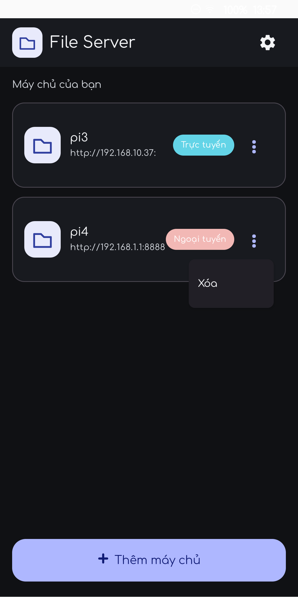
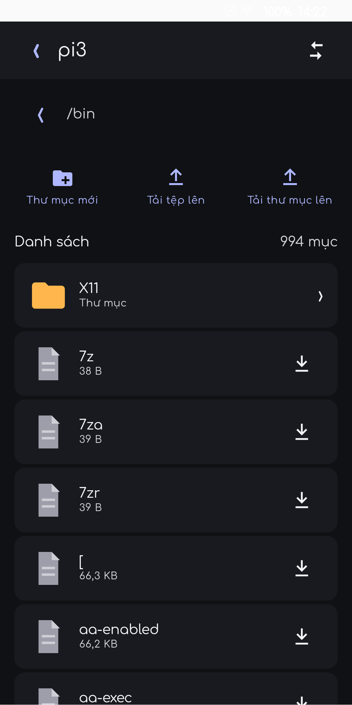
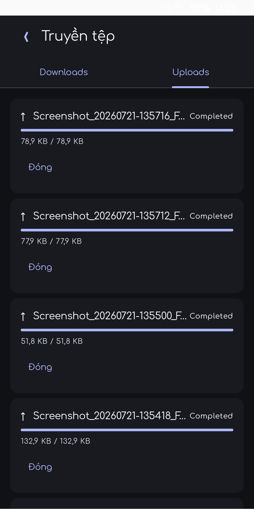

# File Server for Android

Ứng dụng Android native để duyệt, xem trước và truyền tệp với máy chủ [File Browser](https://filebrowser.org/). Giao diện được xây dựng bằng Jetpack Compose, tối ưu cho mạng nội bộ và các máy chủ tài nguyên thấp như Raspberry Pi 3.

Native Android client for browsing, previewing, and transferring files with a [File Browser](https://filebrowser.org/) server. The Jetpack Compose UI is designed for local networks and resource-constrained hosts such as Raspberry Pi 3.

## Ảnh chụp / Screenshots

| Máy chủ / Servers | Trình duyệt / Browser | Truyền tệp / Transfers |
| --- | --- | --- |
|  |  |  |

## Tiếng Việt

### Tính năng

- Quản lý nhiều máy chủ File Browser và kiểm tra trạng thái trực tuyến/ngoại tuyến.
- Đăng nhập an toàn theo phiên: thông tin đăng nhập chỉ tồn tại trong RAM, được giữ khi app chạy nền và bị xóa khi app đóng hẳn.
- Duyệt thư mục theo trang, kéo xuống để làm mới, chuyển đổi danh sách/lưới và chọn bộ biểu tượng thư mục.
- Tạo thư mục, tải tệp/thư mục lên, tải xuống, di chuyển và xóa nhiều mục theo quyền của máy chủ.
- Hàng đợi truyền tệp riêng cho Uploads và Downloads, hiển thị tiến trình, retry, mở tệp tải về và xóa toàn bộ lịch sử từng tab.
- Thumbnail cho ảnh và video; cache cục bộ tự giới hạn 32 MB, xóa ảnh quá 7 ngày và có thể xóa thủ công trong Cài đặt.
- Xem ảnh và vuốt giữa các ảnh trong cùng thư mục.
- Phát video/audio có xác thực, thanh tiến trình, phát/tạm dừng, tua ±5 giây và toàn màn hình ngang.
- Xem PDF, văn bản và mã nguồn dài có cuộn/phân trang: TXT, Markdown, JSON, YAML, XML, ENV, LOG, Python, Kotlin, JavaScript, TypeScript, notebook và nhiều định dạng khác.
- Giao diện sáng/tối, tiếng Việt/English, chọn thư mục tải xuống bằng Storage Access Framework.
- Hỗ trợ Android 8.0 trở lên (API 26+).

### Kết nối máy chủ

1. Cài và chạy một máy chủ File Browser.
2. Trong app, chọn **Thêm máy chủ**.
3. Nhập địa chỉ đầy đủ, ví dụ `http://192.168.1.10:8080`.
4. Chọn máy chủ và đăng nhập bằng tài khoản File Browser.

HTTP được hỗ trợ cho mạng nội bộ nhưng không mã hóa dữ liệu. Hãy dùng HTTPS khi kết nối qua mạng không tin cậy.

### Build APK

Yêu cầu: JDK 17 và Android SDK API 37.

```powershell
.\gradlew.bat assembleDebug
```

APK debug được tạo tại:

```text
app/build/outputs/apk/debug/app-debug.apk
```

## English

### Features

- Manage multiple File Browser servers with online/offline reachability status.
- Process-scoped authentication: credentials stay in memory while the app is active or backgrounded and are cleared when the app is fully closed.
- Paginated directory browsing, pull-to-refresh, list/grid layouts, and selectable folder icon sets.
- Create folders; upload files or directory trees; download, move, and delete multiple resources while respecting server permissions.
- Separate upload/download queues with progress, retry, open-downloaded-item, and per-tab clear-all actions.
- Image and video thumbnails with a 32 MB bounded cache, seven-day expiry, and a manual clear action in Settings.
- Image viewer with navigation between images in the current directory.
- Authenticated video/audio playback with timeline, play/pause, ±5-second seeking, and landscape fullscreen.
- Scrollable, paged previews for PDFs, large text files, and source code including TXT, Markdown, JSON, YAML, XML, ENV, LOG, Python, Kotlin, JavaScript, TypeScript, notebooks, and more.
- Light/dark themes, Vietnamese/English localization, and Storage Access Framework download-directory selection.
- Android 8.0+ support (API 26+).

### Connect to a server

1. Install and run a File Browser server.
2. Select **Add server** in the app.
3. Enter the complete address, for example `http://192.168.1.10:8080`.
4. Select the server and sign in with your File Browser account.

Plain HTTP is supported for local networks but does not encrypt traffic. Use HTTPS on untrusted networks.

### Build the APK

Requirements: JDK 17 and Android SDK API 37.

```powershell
.\gradlew.bat assembleDebug
```

The debug APK is generated at:

```text
app/build/outputs/apk/debug/app-debug.apk
```

## Technology

- Kotlin, Jetpack Compose, Material 3
- Android Media3 / ExoPlayer
- Kotlin Coroutines
- Storage Access Framework
- Android Keystore support for legacy credential migration cleanup

## Security notes

- TLS certificate validation is never disabled.
- Credentials and tokens are not written to logs or transfer history.
- Mutating requests are not automatically replayed after an ambiguous network failure.
- File operations remain subject to permissions enforced by the File Browser server.

## License

No license has been declared yet. Add a license before redistributing the project.
